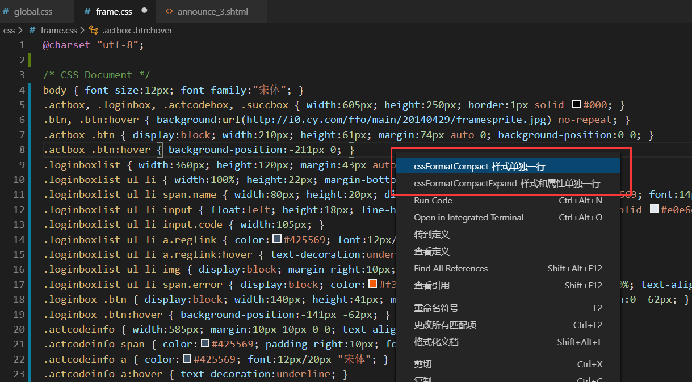

# cssformatcompact README
这是一款vscode的css的样式格式化插件，支持2中风格：
按样式名合并试和展开试
This is a CSS style formatting plug-in of vscode, which supports 2 styles:
Merge and expand tests by style name
## Features

可以实现css的两种格式化，一种是每个样式名的名称和属性格式化到一行，另外一种是每个样式名和属性单独格式化到一行，并且保留注释
Two formats of CSS can be implemented, one is to format the name and attribute of each style name to one line, the other is to format each style name and attribute to one line separately.And keep comments.
### 展开型风格 Unfolding style

### Combined style

### 右键菜单 Right click menu

> Tip: 支持选中后再格式化哦 Support formatting after selecting

## Known Issues

Calling out known issues can help limit users opening duplicate issues against your extension.

## Release Notes 发行说明
头一次做vscode插件，欢迎反馈
Do vscode plug-in for the first time, welcome to feedback
项目地址：
https://github.com/zhidong10/cssformatcompact

## 项目版本
### 1.0.0

-----------------------------------------------------------------------------------------------------------

## Working with Markdown
没有做快捷键的设置，容易跟其他快捷键搞冲突，
想使用快捷键，可以使用vscode自带的`Ctrl+Shift+p`，搜索css一般可以看到提示命令

没有做快捷键的设置，容易跟其他快捷键搞冲突，
想使用快捷键，可以使用vscode自带的`Ctrl+Shift+p`，搜索css一般可以看到提示命令
There is no shortcut key setting, which is easy to conflict with other shortcut keys,

If you want to use shortcut keys, you can use the 'Ctrl + Shift + p' provided by vscode. You can usually see prompt commands when searching CSS

### For more information
my github:
[https://github.com/zhidong10](https://note.youdao.com/)
